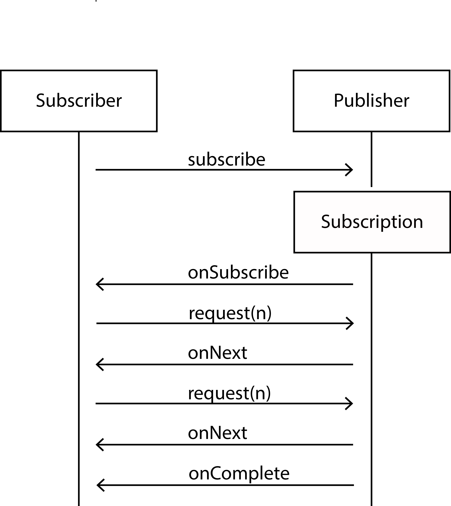

# RxJava 2 en Reactive Streams
RxJava is een library die als doel heeft asynchrone code leesbaarder en beter onderhoudbaar te maken. Inmiddels is de compleet vernieuwde versie 2 uitgebracht welke voldoet aan de Reactive Streams standaard. In dit artikel lees je wat de belangrijkste veranderingen zijn ten opzicht van versie 1.


## De Observable
Het overgrote deel van de applicaties die wij bouwen heeft interactie met de buitenwereld. Bij interactie met bronnen als databases, REST services, het bestanden of gebruikers moet er altijd rekening worden gehouden dat er vertraging kan optreden in de reactie en dat een antwoord zelfs kan uitblijven. Denk hierbij bijvoorbeeld aan netwerk latency of zelfs errors. In je applicatie moet je dus rekening houden dat deze externe calls altijd asynchroon verlopen. Een aanpak hiervoor die steeds meer populariteit geniet is reactive programming.

Voor het schrijven van leesbare asynchrone code kunnen we gebruik maken van ReactiveX (http://reactivex.io). ReactiveX is een library die beschikbaar is voor een grote hoeveelheid programmeertalen, waaronder Scala, JavaScript en Java (RxJava). In Java Magazine 1/2015 hebben we al een introductie gegeven van RxJava. Inmiddels is RxJava 2 uitgebracht. De grootste verandering is dat deze de Reactive Streams API (http://www.reactive-streams.org) implementeert. In dit artikel kijken we naar de nieuwe functies van RxJava 2. Voor we daar mee aan de slag gaan, geven we in Listing 1 nog een voorbeeld van hoe je in RxJava met behulp van de Observable data van verschillende asynchrone bronnen kunt combineren om tot een resultaat te komen. Zonder RxJava en de Observable hadden we gebruik moeten maken van callbacks, wat veel onleesbaardere code had opgeleverd.

```java
//PersonRepository
public Observable<Person> findByName(String name);
public Observable<BigDecimal> getIncome(Person person);

//Aanroep
repository.findByName("Erwin").filter(person -> person.getAge() >= 65)
                .flatMap(person -> repository.getIncome(person))
                .subscribe(income -> totalIncome = totalIncome.add(income));
```
Listing 1

De Observable is het centrale concept binnen RxJava. Een Observable is een potentieel oneindige lijst data waarop we één of meerdere subscribers kunnen registeren. De subscribers verwerken vervolgens de items in de stroom één voor één. In het voorbeeld in Listing 1 halen we uit onze repository alle personen op met naam de "Erwin". We gebruiken vervolgens de filter methode om alleen de personen met een leeftijd van 65 jaar of ouder te selecteren. Van elke persoon halen we het inkomen op. Dit is een asynchrone operatie. We willen van personen ouder dan 65 hun inkomen ophalen. Hiervoor combineren we het resultaat van de eerste Observable met een tweede Observable. Hiervoor gebruiken we de flatMap operatie. De omschrijving van de flatMap operatie is als volgt: "The FlatMap operator transforms an Observable by applying a function that you specify to each item emitted by the source Observable, where that function returns an Observable that itself emits items. FlatMap then merges the emissions of these resulting Observables, emitting these merged results as its own sequence". Dit is anders dan de map operatie, waarbij geen gebruik wordt gemaakt van een tweede Observable voor de transformatie.
Het resultaat van de flatMap operatie is een Observable met items van type BigDecimal die het inkomen representeren van elk van de personen boven de 65.

## Ondersteuning voor de Reactive streams API
Reactive Streams is een initiatief om een generieke API te bieden voor de verwerking van data streams voor diverse programmeertalen en netwerk protocollen. Om optimaal gebruik te maken de beschikbare resources is de verwerking asynchroon en non-blocking. Het is belangrijk om te rekening te houden dat er bronnen zijn die sneller data kunnen produceren dan de ontvangers deze data kunnen verwerken. Hiervoor is het van belang dat de datastroom controleerbaar is. Dit gebeurt doormiddel van back pressure. Met back pressure laat je databronnen weten dat er minder stel items geproduceerd moeten worden. Deze communicatie is upstream, tegen de richting van de data in. Back pressure is dus een belangrijk onderdeel van het Reactive Streams model.

De RxJava 1 implementatie kende ook al mogelijkheden om met back pressure om te gaan. In principe kon je met de Observable altijd gebruik maken van back pressure, echter ondersteunen niet alle asynchrone bronnen dit. In de praktijk kon dit leiden tot een Exceptie tijdens het uitvoeren van je applicatie. Een voorbeeld van een bron waar je geen back pressure op kunt toepassen is bijvoorbeeld een timer die waardes produceert met een vast interval, bijvoorbeeld elke seconde. Als je het produceren van items zou vertragen, klopt het interval niet meer. Een ander voorbeeld is een app waarbij de gebruiker met zijn vinger kan tekenen op het scherm. Het tekenen op het scherm produceert een stroom van events. Je kunt niet tegen de gebruiker zeggen dat deze langzamer moet gaan tekenen.


Bronnen waarbij je de snelheid van het produceren van events kan reguleren en bronnen waarbij dit niet kan worden in RxJava 1 beiden gerepresenteerd door het Observable type. Als je back pressure toe probeert te passen bij bronnen die dit niet ondersteunen krijg je een foutmelding. Om deze onduidelijkheid op te lossen is er in RxJava 2 een tweede type naast de Observable geïntroduceerd, met de naam Flowable. Beide types representeren een potentieel oneindige stroom van 0 of meer items. Beide types kunnen eindigen met een complete of een error. De Observable gebruik je voor bronnen die backpressure niet ondersteunen, de Flowable voor bronnen die dit wel ondersteunen. De Java versie van de Reactive Streams API bevat 4 interfaces: de Subscriber, de Publisher, de Processor en de Subscription. Flowable implementeert de Reactive Streams interface Publisher. Om gebruik te maken van de data van een Observable (geen back pressure), koppel je er via de subscribe methode één of meerdere Observers aan. Om gebruik te maken van een Publisher (wel back pressure) gebruik je de subscribe methode om één of meerdere Subscribers te koppelen. De Subscriber interface van Reactive Streams definieert net als de Observer interface van RxJava de methodes onNext, onError, onSubscribe en onComplete. Doordat de Flowable de Publisher interface van Reactive Streams implementeert en gebruikt in zijn methodes, is deze direct compatible met andere Reactive Streams implementaties. Aangezien bij de Observable de geproduceerde items gebuffered worden en snelheid van productie niet kan worden aangepast, is deze voornamelijk geschikt voor kleinere aantallen (< 1000 items). Je wilt namelijk een OutOfMemoryException voorkomen; deze zou kunnen onstaan doordat er teveel items worden gebuffered.

## De Flowable
Listing 2 laat een voorbeeld zien van het gebruik van de Flowable. We creëren een Flowable die de int waarden 1,2,3 produceert. Het type hiervan is Publisher<Integer>. Vervolgens maken we een Subscriber<Integer> aan die we via de subscribe methode abonneren op de items die door de Publisher worden gepubliceerd.

```java
public class SubcriberPublisher {
    public static void main(String[] args) throws InterruptedException {
        Publisher<Integer> intProducer = Flowable.just(1, 2, 3);

        intProducer.subscribe(new Subscriber<Integer>() {
            @Override
            public void onSubscribe(@NonNull Subscription subscription) {
                System.out.println("subscribed");
                subscription.request(1);
            }

            @Override
            public void onNext(@NonNull Integer integer) {
                System.out.println(integer);
                subscription.request(1);
            }

            @Override
            public void onError(@NonNull Throwable throwable) {
                System.out.println("Error");
            }

            @Override
            public void onComplete() {
                System.out.println("completed");
            }
        });

        Thread.sleep(10000);
    }
}
```
Listing 2

In de onSubscribe methode roepen we de request methode aan op de subscription. Dit is de methode waarmee we back pressure kunnen uitvoeren. In dit geval vragen we één item op. Als we klaar zijn met dit item te verwerken in de onNext methode vragen we het volgende item op. Je kunt echter ook meer items aanvragen, deze verwerken en vervolgens weer nieuwe items aanvragen. Als er geen items meer zijn wordt de onComplete methode op de subscribers aangeroepen. Dit proces is schematisch weergegeven in Afbeelding 1.


Afbeelding 1

Om gebruik te kunnen maken van de krachtige operaties die we kennen van de Observable, moeten we gebruik maken van het type Flowable. Op de Publisher interface zijn deze namelijk niet beschikbaar. In Listing 3 maken we een Flowable, waarna we via de filter operatie alle even getallen selecteren die we met behulp van de map functie delen door 2. Deze code print dus de getallen 0 t/m 49.

```java
Flowable<Integer> ints = Flowable.range(0,100);
ints.filter(i -> i%2 == 0).map(even -> even/2).subscribe(System.out::println);
```
Listing 3.

## Java 8 Streams, RxJava en Reactive Streams
De operaties op Observable en Flowable lijken erg op de operaties die beschikbaar zijn als onderdeel van de Java 8 Streams API. Java 8 Streams en RxJava lossen echter beide verschillende problemen op. Java 8 Streams zijn in principe een tool om operaties op bestaande collecties te vereenvoudigen. Met RxJava reageer je op binnenkomende items. Java 8 Streams wordt hierom pull based genoemd, de items worden stuk voor stuk uit de collectie gehaald. RxJava is push based, de items worden aangeboden via de onNext methode van de Observer.

```java
//Java Streams op een bestaande collectie
List<Long> numbers = Arrays.asList(1l,2l,3l,4l,5l,6l,7l,8l);
List<Long> evens = numbers.stream().filter(x -> x % 2 == 0).collect(Collectors.toList());
evens.forEach(System.out::println);

//RxJava werkt met items die aangeleverd worden over tijd
Observable<Long> infiniteNumbers = Observable.interval(1, TimeUnit.SECONDS);
Observable<Long> infiniteEvens = infiniteNumbers.filter(x -> x % 2 == 0);
infiniteEvens.subscribe(System.out::println);
```
Listing 9

Listing 9 laat dit verschil zien. Met de Java 8 Streams API wordt van de lijst met nummers één voor één de elementen gelezen om te controleren of het om een even nummer gaat, deze nummers worden vervolgens verzameld in de lijst van even nummers.
In het RxJava voorbeeld wordt een Observable gemaakt die gebruikt wordt om steeds een nieuw nummer door te geven. Deze nummers kunnen dus ook in de toekomst ontstaan. Doormiddel van de filter functie wordt een Observable gemaakt waar alleen even nummers in worden doorgegeven, nummers die dus nu nog niet bestaan.

Er zijn meer verschillen tussen Java 8 Streams en RxJava. Een voordeel van RxJava Observables is dat deze meerdere subscribers kunnen hebben, welke ieder hun eigen operaties op de inkomende items kunnen uitvoeren. Omdat  Java 8 Streams pull based zijn, zijn er geen mogelijkheden om items over tijd aan te leveren. Er zijn dan ook geen tijd gerelateerde operaties zoals bijvoorbeeld de Observable.interval of Observable.delay operaties.

Eén van de onderdelen van Java 9 wordt hoogstwaarschijnlijk de Flow API (https://community.oracle.com/docs/DOC-1006738). Deze API bevat interfaces die overeenkomen met de Reactive Streams API, die als standaard wordt gezien. Het doel is om verschillende reactive stream implementaties te kunnen gebruiken via dezelfde interfaces. De Java 9 Flow API heeft zijn eigen reactive stream interfaces, welke hetzelfde zijn als deze van de reactive streams API. Dit is belangrijk aangezien het anders een afhankelijkheid zou hebben naar de Reactive Streams API (org.reactivestreams:reactive-streams:1.0.0). Naast RxJava zijn er meerdere implementaties van de reactive streams specificatie, bijvoorbeeld Akka Streams, Spring Reactor en Vert.x. Ook is er bijvoorbeeld een Reactive Streams Java driver voor MongoDB (http://mongodb.github.io/mongo-java-driver-reactivestreams).

## Conclusie
RxJava is onderdeel van ReactiveX, een API voor asynchroon programmeren met observable streams (http://reactivex.io). Naast een Java implementatie zijn er ook implementaties voor Scala, Groovy, JavaScript, .Net, Clojure, Swift en meer. RxJava werkt met JDK 6 en hoger, wat het ook geschikt maakt voor Android, een omgeving waarbij veel met asynchrone code gewerkt wordt.
ReactiveX werkt volgens het create, combine, en listen principe. Tijdens de create fase wordt een Observable of Flowable gemaakt. Deze kun je zelf
RxJava 2  is compleet herschreven voor de implementatie van de Reactive Streams API. Het verschil tussen bronnen die back pressure ondersteunen (Flowable) en bronnen die geen back pressure ondersteunen (Observable) is nu expliciet gemaakt, om fouten bij het uitvoeren van de applicatie te voorkomen. De Flowable is het Object wat de Reactive Streams standaard implementeert, aangezien er binnen Reactive Streams altijd rekening wordt gehouden met back pressure.
Met deze nieuwe implementatie sluit RxJava beter aan op de overige ontwikkelingen binnen de reactive programming wereld.

ReactiveX en daarmee RxJava is bedoeld om reactive programming eenvoudiger te maken. De krachtige API en de mogelijkheden om verschillende asynchrone bronnen te combineren leidt tot minder complexe code. Het opnemen van de Reactive Streams API als onderdeel van Java 9 geeft aan dat reactive programming steeds populairder wordt. Mocht je een applicatie hebben die gebruikt maakt van het reactive programming model, dan is het zeker aan te bevelen om je te verdiepen in ReactiveX.
