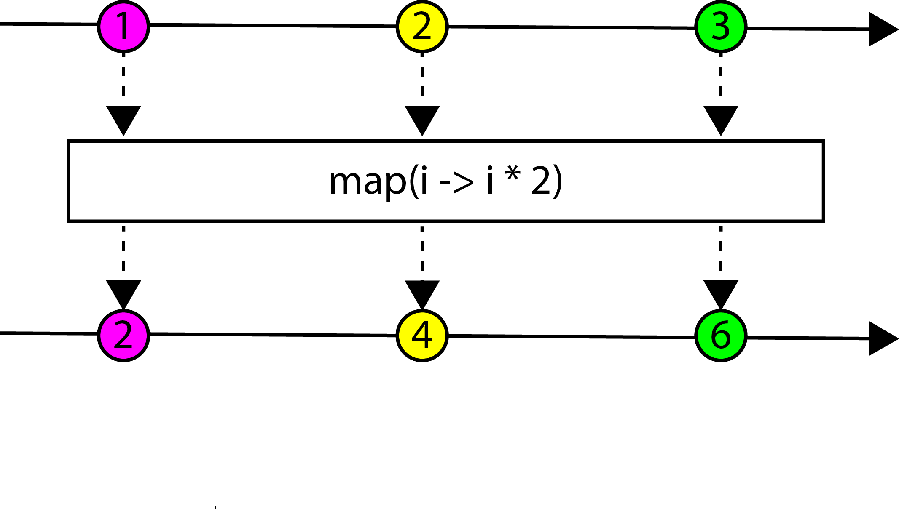

# Reactive programming met RxJava
Het overgrote deel van de applicaties die wij bouwen heeft interactie met de buitenwereld. Bij interactie met bronnen als databases, REST services, het file system of gebruikers moet er altijd rekening worden gehouden dat er vertraging kan optreden in de reactie en dat een antwoord zelfs kan uitblijven. Denk hierbij bijvoorbeeld aan netwerk latency of zelfs errors. In je applicatie moet je dus rekening houden dat deze externe calls altijd asynchroon verlopen. Een aanpak hiervoor die steeds meer populariteit geniet is reactive programming.

Bij reactive programming kun je gebruik maken van callbacks om het resultaat te ontvangen. In plaats van te blocken op een methode aanroep en te wachten tot de methode retourneert, geeft je een functie mee die wordt aangeroepen zodra het resultaat beschikbaar is. Vergelijk in listing 1 de beide methodes. De eerste methode heeft als return type een lijst van personen. De tweede methode heeft geen return waarde, in plaats hiervan is het laatste argument van de methode van het type callback. De generic type geeft aan dat er een lijst van personen verwacht kan worden.

```java
//Synchrone API
public List<Person> findByName(String name);

//Asynchrone API
public void findByName(String name, Callback<List<Person>> persons)
```
Listing 1

```java
//Synchrone API
List<Person> persons = repository.findByName("Erwin");

//Asynchrone API
repository.findByName("Erwin", persons -> {
    //do something with persons
});
```
Listing 2

Listing 2 geeft een voorbeeld van het gebruik van beide methodes. Java 8 lambda's helpen ons hier om het resultaat te kunnen verwerken zonder gebruik te hoeven maken van anonymous classes. Laten we een uitgebreider voorbeeld bekijken. Stel dat we geïnteresseerd zijn in het het totale jaarinkomen van alle personen ouder dan 65. Het jaarinkomen wordt apart opgeslagen, dus hier hebben we een tweede asynchrone call naar de repository voor nodig. In Listing 3 tonen we dit voorbeeld. We focussen hier alleen op de asynchrone API en maken gebruik van de Java 8 Streams functionaliteit.

```java
repository.findByName("Erwin", persons ->
            persons.stream().filter(person -> person.getAge() >= 65).forEach(person -> {
                repository.getIncome(person, income ->
                    totalIncome = totalIncome.add(income)
                );
            })
        );
```
Listing 3

Omdat we twee asynchrone calls moeten nesten, wordt de code al minder leesbaar en complexer. Een oplossing zou kunnen zijn om te code te verdelen over meerdere methodes, dit geeft wel veel extra code voor een relatief eenvoudig algoritme.

## RxJava en de Observable
Voor het schrijven van beter leesbare asynchrone code kunnen we gebruik maken van ReactiveX (http://reactivex.io). ReactiveX is een library die beschikbaar is voor een grote hoeveelheid programmeertalen, waaronder Scala, JavaScript en Java (RxJava). Het centrale concept binnen ReactiveX is de Observable. Een Observable is een collectie van data die over tijd aangeleverd wordt. Deze data kan vervolgens op allerlei manieren bewerkt worden. Om iets met de data te kunnen doen maken we gebruik van een Observer. Deze verbinden we met de Observable via de subscribe methode.

```java
Observable<Integer> intObservable = Observable.create(observableEmitter -> {
           observableEmitter.onNext(1);
           observableEmitter.onNext(2);
           observableEmitter.onNext(3);
           observableEmitter.onComplete();
       });

       intObservable.subscribe(new Observer<Integer>() {
           @Override
           public void onSubscribe(@NonNull Disposable disposable) {
               System.out.println("subscribed");
           }

           @Override
           public void onNext(@NonNull Integer integer) {
               System.out.println(integer);
           }

           @Override
           public void onError(@NonNull Throwable throwable) {
               System.out.println("Error");
           }

           @Override
           public void onComplete() {
               System.out.println("completed");
           }
       });
```
Listing 4

Listing 4 toont een voorbeeld van een eenvoudige Observable. We kunnen een Observable aanmaken door gebruik te maken van de create methode. Vervolgens roepen we 3 keer de onNext methode aan om een waarde te produceren. Tot slot gebruiken we onComplete om de Observable af te sluiten. De Observer implementeert de onSubscribe, onNext, onError en onComplete methodes. Het resultaat van dit voorbeeld is "subscribed,1,2,3,completed".


## Observable tranformaties
Het is niet persé nodig om een volledige Observer te implementeren. Van de subscribe methode zijn versies beschikbaar die aangeroepen kunnen worden met een lambda functie voor de implementatie van bijvoorbeeld de onNext en onError.

```java
intObservable.map(i -> i*2).filter(p -> p > 4).subscribe(value -> System.out.println(value));
```
Listing 5

In het voorbeeld van Listing 5 implementeren we de onNext methode direct met een lambda functie. Voordat we het resultaat van de Observable tonen, transformeren we het eerst doormiddel van de map functie. De intObservable produceert de waardes 1,2,3. Het resultaat na de map functie is 2,4,6. Vervolgens gebruiken we een filter functie om alleen te getallen hoger dan 4 te tonen. Het resultaat van deze code is "6".
Voor het beschrijven van operaties kunnen we gebruik maken van een zogenaamd "marble diagram". Dit is een visualisatie van de operatie over tijd. Het marble diagram voor onze map functie zie je in afbeelding 1.


Afbeelding 1


## Inkomens ophalen met RxJava
Nu we de basis van Observables, transformaties en Observers kennen, kunnen we het voorbeeld waarbij we de inkomens van personen boven de 65 ophalen implementeren met RxJava. Deze implementatie is te zien in Listing 6.

```java
//PersonRepository
public Observable<Person> findByName(String name);
public Observable<BigDecimal> getIncome(Person person);

//Aanroep
repository.findByName("Erwin").filter(person -> person.getAge() >= 65)
                .flatMap(person -> repository.getIncome(person))
                .subscribe(income -> totalIncome = totalIncome.add(income));
```
Listing 6

We halen eerst alle personen op met de naam "Erwin". De RX versie van de findByName methode heeft als return type een Observable van type Person. We maken dus geen gebruik meer van de Callback syntax. De getIncome methode geeft ons het inkomen van de gegeven persoon. Het resultaat is een Observable met items van het type BigDecimal.
We filteren de totale lijst van personen met de filter functie. We gebruiken een lambda functie om aan te geven dat we alleen geïnteresseerd zijn in personen met een leeftijd groter of gelijk aan 65. Van deze personen willen we het inkomen ophalen. Dit is wederom een asynchrone operatie. We willen de Observable met personen ouder dan 65 tranformeren in een lijst van inkomens, met behulp van een tweede Observable. Hiervoor gebruiken we de flatMap operatie. De omschrijving van de flatMap operatie is als volgt: "The FlatMap operator transforms an Observable by applying a function that you specify to each item emitted by the source Observable, where that function returns an Observable that itself emits items. FlatMap then merges the emissions of these resulting Observables, emitting these merged results as its own sequence.". Dit is anders dan de map operatie, waarbij geen gebruik wordt gemaakt van een tweede Observable voor de transformatie.
Het resultaat van de flatMap operatie is een Observable met items van type BigDecimal die het inkomen representeren van elk van de personen boven de 65. Via de subscribe methode kunnen we een Observer functie meegeven om de inkomens bij het totaal op te tellen, analoog aan ons voorbeeld met de callback syntax.


# Een oneindige lijst van items
Tot nu toe hebben we Observables gebruikt om items in een eindige lijst te bewerken. Een Observable representeert echter een oneindige lijst van items. Dit maakt het een krachtig concept, omdat je bewerkingen kunt definiëren op items die over tijd worden aangeleverd. Een eenvoudig voorbeeld van een oneindige lijst van items is een timer die elke seconde een waarde produceert (Listing 7). Maar ook het indrukken van een toest op een toetsenbord door een gebruiker (Listing 8), berichten die binnenkomen op een queue, of communicatie via websockets zijn voorbeelden van potentieel oneindige bronnen van data.

```java
Observable timer = Observable.interval(1, TimeUnit.SECONDS);
```
Listing 7

```java
Observable.create(observableEmitter -> {
             final KeyListener listener = new KeyListener() {
                 @Override
                 public void keyPressed(KeyEvent event) {
                     observableEmitter.onNext(event);
                 }

                 @Override
                 public void keyReleased(KeyEvent event) {
                     observableEmitter.onNext(event);
                 }

                 @Override
                 public void keyTyped(KeyEvent event) {
                     observableEmitter.onNext(event);
                 }
             };
         });
```
Listing 8

Met RxJava kun je dus operaties uitvoeren op meerdere items die pas in de toekomst ontstaan. Dit maakt deze library erg geschikt om verschillende asynchrone bronnen te combineren en hier bewerkingen op uit te voeren.


## Streams en Reactive Streams
De operaties op Observables lijken erg op de operaties die beschikbaar zijn als onderdeel van de Java 8 Streams API. Java 8 Streams en RxJava lossen echter beide verschillende problemen op. Java 8 Streams zijn in principe een tool om operaties op bestaande collecties te vereenvoudigen. Met RxJava reageer je op binnenkomende items. Java 8 Streams wordt hierom pull based genoemd, de items voor stuk voor stuk uit de collecite gehaald. RxJava is push based, de items worden aangeboden via de onNext methode van de Observer.

```java
//Java Streams op een bestaande collectie
List<Long> numbers = Arrays.asList(1l,2l,3l,4l,5l,6l,7l,8l);
List<Long> evens = numbers.stream().filter(x -> x % 2 == 0).collect(Collectors.toList());
evens.forEach(System.out::println);

//RxJava op stroom van items die aangeleverd worden over tijd
Observable<Long> infiniteNumbers = Observable.interval(1, TimeUnit.SECONDS);
Observable<Long> infiniteEvens = infiniteNumbers.filter(x -> x % 2 == 0);
infiniteEvens.subscribe(System.out::println);
```
Listing 9

Listing 9 laat dit verschil zien. Met de Java 8 Streams API wordt van de lijst met nummers één voor één de elementen gelezen om te checken of het om een even nummer gaat, de even nummers worden vervolgens verzameld in de lijst van even nummers.
In het RxJava voorbeeld wordt een een Observable gemaakt die gebruikt wordt om steeds een nieuw nummer door te geven. Deze nummers kunnen dus ook in de toekomst ontstaan. Doormiddel van de filter functie wordt een Observable gemaakt waar alleen even nummers in worden doorgegeven, nummers die dus nu nog niet bestaan.

Er zijn meer verschillen tussen Java 8 Streams en RxJava. Zo kunnen Java 8 Streams één keer gebruikt worden, op RxJava Observables kun je meerdere subscribers hebben. Omdat Streams pull based zijn, zijn er geen mogelijkheden om items over tijd aan te leveren. Er zijn dan ook geen tijd gerelateerde operaties zoals bijvoobeeld de Observable.interval of Observable.delay operaties.

RxJava 2 bevat een implementatie van de reactive streams API (http://www.reactive-streams.org). Dit is een initiatief om een standaard te maken die over verschillende talen en platformen heen operaties biedt om te werken met asynchrone streams. Deze standaard is zowel van toepassing op de JVM en JavaScript runtimes als op netwerk protocollen. De terminologie binnen de reactive streams API wijkt helaas af van de RxJava terminologie. Zo wordt er gesproken over een Publisher van data en een Subscriber. Eén van de onderdelen van Java 9 wordt hoogstwaarschijnlijk de Flow API (https://community.oracle.com/docs/DOC-1006738). Deze API bevat interfaces die overeenkomen met de reactive streams API, die als standaard wordt gezien. Het doel is om verschillende reactive stream implementaties te kunnen gebruiken via dezelfde interfaces. Java 9 heeft zijn eigen reactive stream interfaces, omdat het anders een afhankelijkheid zou hebben naar de reactive stream interfaces voor Java (org.reactivestreams:reactive-streams:1.0.0). Naast RxJava zijn er meerdere implementaties van de reactive streams specificatie, bijvoorbeeld Akka Streams, Spring Reactor en Vert.x. Ook is er bijvoorbeeld een Reactive Streams Java driver voor MongoDB (http://mongodb.github.io/mongo-java-driver-reactivestreams).

## Conclusie
RxJava is onderdeel van ReactiveX, een API voor asynchroon programmeren met observable streams (http://reactivex.io). ReactiveX is gebaseerd op de patterns Observer/Observable en Iterator en maakt gebruik van paradigma's uit de functioneel programmeren hoek. ReactiveX bevat naast een Java implementatie ook implementaties voor Scala, Groovy, JavaScript, .Net, Clojure, Swift en meer. RxJava werkt met JDK 6 en hoger, wat het ook geschikt maakt voor Android, een omgeving waarbij veel met asynchrone code gewerkt wordt.
ReactiveX werkt volgens het create, combine, en listen principe. Tijdens de create fase wordt een Observable gemaakt. Deze kun je zelf aanmaken, door gebruik te maken van verschillende bestaande operaties. Verschillende frameworks, zoals bijvoorbeeld Vert.x, hebben API's die gebruik maken van de Observable als return type.
Tijdens de combine fase worden operaties gedefinieerd om de items die worden geproduceerd door een Observable te transformeren en te combineren met andere Observables.
Tot slot worden tijdens de listen fase nul of meerdere subscribers gedefinieerd die iets de geproduceerde items consumeren, bijvoorbeeld om deze te tonen op het scherm.

ReactiveX en daarmee RxJava is bedoeld om reactive programming eenvoudiger te maken. De krachtige API en de mogelijkheden om verschillende asynchrone bronnen te combineren leidt tot minder complexe code. Het opnemen van de reactive streams api als onderdeel van Java 9 geeft aan dat reactive programming steeds populairder wordt. Mocht je bezig je een applicatie hebben die gebruikt maakt van het reactive programming model, dan is het zeker aan te bevelen om te investeren in ReactiveX.
